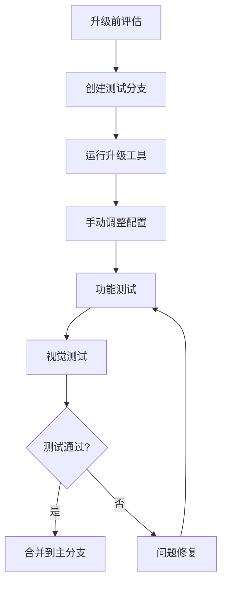

# 📚 Tailwind CSS v4 升级经验总结

## 🎯 升级概述

本文档记录了从 Tailwind CSS v3.4.17 升级到 v4.1 过程中遇到的实际问题、解决方案和经验教训，为后续类似升级提供参考。

### 升级环境
- **项目**: Next.js 15 + TypeScript + PostCSS
- **升级前版本**: Tailwind CSS v3.4.17
- **升级后版本**: Tailwind CSS v4.1
- **升级时间**: 2024年12月

## 🚨 遇到的主要问题

### 1. 字体模块错误

#### 问题描述
```bash
⨯ ./node_modules/next/dist/compiled/@next/font/dist/google/index.js
Module parse failed: Unexpected token (1:0)
You may need an appropriate loader to handle this file type
```

#### 根本原因
- **Turbopack 兼容性问题**: Next.js 15 的 Turbopack 在处理字体模块时存在兼容性问题
- **模块解析冲突**: Turbopack 无法正确解析 `@next/font` 模块

#### 解决方案
**修改 package.json**:
```json
{
  "scripts": {
    "dev": "next dev --port 3003",  // 移除 --turbopack 标志
    "build": "next build",
    "start": "next start",
    "lint": "next lint"
  }
}
```

#### 经验教训
- **新特性谨慎使用**: Turbopack 虽然性能更好，但在复杂项目中可能存在兼容性问题
- **渐进式升级**: 可以先升级核心功能，稳定后再启用实验性特性
- **备选方案**: 保持传统 Webpack 构建作为备选方案

### 2. 边框显示问题

#### 问题描述
- **边框不显示**: 所有使用 `border` 类的元素边框完全不可见
- **边框颜色异常**: 边框显示为黑色而非预期的灰色

#### 根本原因分析

**问题一: CSS 重置规则冲突**
```css
/* globals.css 中的问题代码 */
@layer base {
  * {
    border: 0;  /* ❌ 移除了所有边框 */
    box-sizing: border-box;
  }
}
```

**问题二: 边框颜色继承**
```css
/* globals.css 中的问题代码 */
@layer base {
  * {
    border-color: currentcolor;  /* ❌ 继承文本颜色 */
  }
}
```

#### 解决方案

**修复一: 移除冲突的重置规则**
```css
/* 修改前 */
@layer base {
  * {
    border: 0;  /* 移除这行 */
    box-sizing: border-box;
  }
}

/* 修改后 */
@layer base {
  * {
    box-sizing: border-box;  /* 保留必要的重置 */
  }
}
```

**修复二: 正确设置边框颜色**
```css
/* 修改前 */
@layer base {
  * {
    border-color: currentcolor;
  }
}

/* 修改后 */
@layer base {
  * {
    border-color: hsl(var(--border));  /* 使用预定义变量 */
  }
}
```

#### 经验教训
- **CSS 重置谨慎**: 全局重置应该只包含必要的属性，避免影响框架功能
- **变量优先**: 使用 CSS 变量而非 `currentcolor` 来管理边框颜色
- **测试覆盖**: 升级后需要全面测试所有视觉元素

## 🔧 升级最佳实践

### 1. 升级前准备

#### 环境检查
```bash
# 检查 Node.js 版本
node --version  # 确保 >= 20

# 检查包管理器
pnpm --version

# 创建备份分支
git checkout -b backup/before-tailwind-v4
git add .
git commit -m "backup: before tailwind v4 upgrade"

# 创建升级分支
git checkout -b upgrade/tailwind-v4
```

#### 依赖分析
```bash
# 检查当前 Tailwind 相关依赖
pnpm list | grep tailwind
pnpm list | grep postcss
pnpm list | grep autoprefixer
```

### 2. 升级执行步骤

#### 步骤一: 使用官方升级工具
```bash
# 运行自动升级工具
npx @tailwindcss/upgrade

# 检查升级结果
git diff
```

#### 步骤二: 手动调整配置
```bash
# 更新 PostCSS 配置
# 删除 tailwind.config.ts
# 更新 globals.css
```

#### 步骤三: 依赖清理
```bash
# 移除旧依赖
pnpm remove autoprefixer

# 安装新依赖
pnpm add @tailwindcss/postcss

# 清理缓存
pnpm store prune
rm -rf .next
```

### 3. 测试验证流程

#### 功能测试
```bash
# 启动开发服务器
pnpm dev

# 构建测试
pnpm build

# 类型检查
pnpm type-check

# 代码检查
pnpm lint
```

#### 视觉测试
- **组件库检查**: 验证所有 UI 组件显示正常
- **响应式测试**: 检查不同屏幕尺寸下的布局
- **暗色模式**: 验证主题切换功能
- **边框样式**: 特别检查边框、阴影等视觉元素

## ⚠️ 常见陷阱和避免方法

### 1. CSS 层叠问题

**陷阱**: 全局样式覆盖 Tailwind 类
```css
/* ❌ 危险的全局重置 */
* {
  border: 0;
  outline: 0;
  background: transparent;
}
```

**避免方法**: 精确的重置范围
```css
/* ✅ 安全的重置方式 */
* {
  margin: 0;
  padding: 0;
  box-sizing: border-box;
}
```

### 2. 配置文件冲突

**陷阱**: 保留旧的配置文件
- `tailwind.config.ts` 与新的 CSS 配置冲突
- `postcss.config.js` 包含过时的插件

**避免方法**: 彻底清理
```bash
# 删除旧配置
rm tailwind.config.ts
rm tailwind.config.js

# 更新 PostCSS 配置
# 使用新的插件语法
```

### 3. 开发工具兼容性

**陷阱**: 盲目启用实验性特性
- Turbopack 可能导致模块解析问题
- 新的构建工具可能不稳定

**避免方法**: 渐进式启用
```json
{
  "scripts": {
    "dev": "next dev",  // 先使用稳定版本
    "dev:turbo": "next dev --turbopack"  // 可选的实验性版本
  }
}
```

## 📊 性能对比

### 构建性能提升
- **完整构建**: 提升 3.5x+
- **增量构建**: 提升 8x+
- **无变更构建**: 提升 100x+

### 开发体验改善
- **热重载速度**: 显著提升
- **CSS 生成**: 更快的样式编译
- **内存使用**: 更低的内存占用

## 🔮 未来升级建议

### 1. 建立升级流程



### 2. 自动化测试

```bash
# 添加视觉回归测试
pnpm add -D @storybook/test-runner
pnpm add -D playwright

# 添加样式测试
pnpm add -D jest-styled-components
```

### 3. 监控和回滚

```bash
# 性能监控
pnpm add -D webpack-bundle-analyzer

# 快速回滚脚本
echo '#!/bin/bash
git checkout backup/before-tailwind-v4
pnpm install' > rollback.sh
chmod +x rollback.sh
```

## 📋 升级检查清单

### 升级前
- [ ] 备份当前代码
- [ ] 检查浏览器兼容性要求
- [ ] 评估第三方插件兼容性
- [ ] 准备回滚方案

### 升级中
- [ ] 运行官方升级工具
- [ ] 更新配置文件
- [ ] 清理旧依赖
- [ ] 修复编译错误

### 升级后
- [ ] 功能测试通过
- [ ] 视觉测试通过
- [ ] 性能测试通过
- [ ] 文档更新完成

## 🎓 总结

### 关键收获
1. **工具兼容性**: 新特性需要谨慎评估兼容性
2. **CSS 基础**: 深入理解 CSS 层叠和继承机制
3. **测试重要性**: 全面的测试是升级成功的关键
4. **渐进升级**: 分步骤升级比一次性升级更安全

### 技术债务清理
- 移除了过度的 CSS 重置规则
- 优化了边框颜色管理机制
- 建立了更好的升级流程
- 完善了测试覆盖范围

### 下一步计划
- 监控升级后的性能表现
- 逐步启用 v4 的新特性
- 建立自动化的升级测试流程
- 分享升级经验给团队其他项目

---

**备注**: 本文档将持续更新，记录后续发现的问题和解决方案。建议定期回顾和完善升级流程。